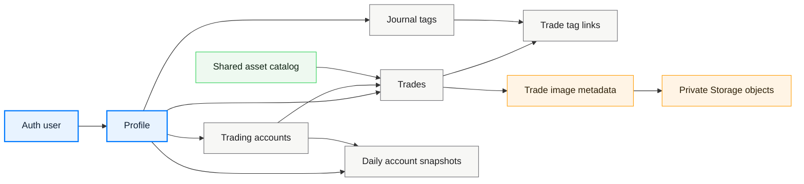
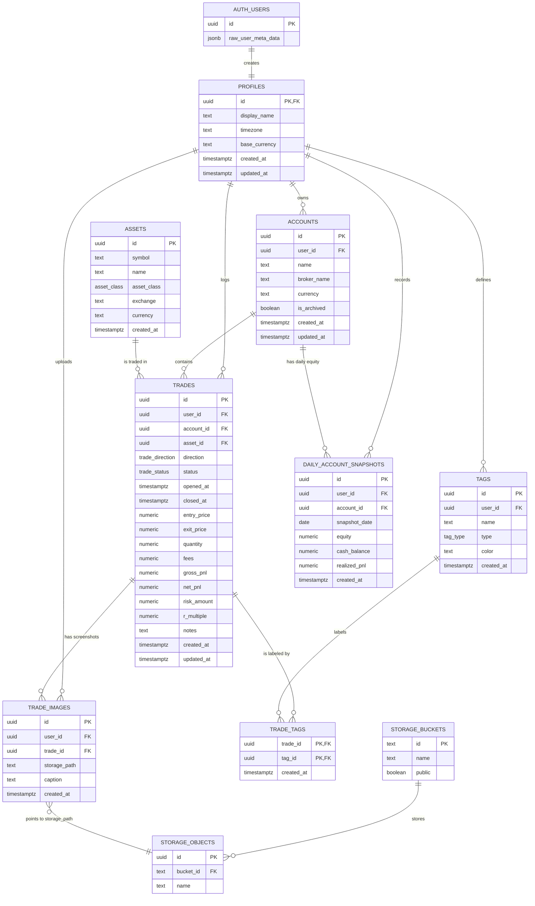

# Polaris Database ERD

This diagram is generated from the Supabase migrations in `supabase/migrations`.
It covers every application table plus the Supabase-managed tables the app depends on:
`auth.users`, `storage.buckets`, and `storage.objects`.

## Domain Map

## Entity Relationship Diagram

## How To Read It

- `auth.users` is the identity source. A database trigger creates one `profiles` row for each new auth user.
- `profiles` is the ownership root for user-private data. Accounts, trades, tags, images, and snapshots all trace back to it for RLS.
- `accounts` groups trades and daily equity snapshots for a user.
- `assets` is shared reference data. Authenticated users can read and insert assets, but assets are not owned by one profile.
- `trades` is the central journal record. It belongs to one profile, one account, and one asset.
- `tags` are user-owned labels. `trade_tags` is the many-to-many join table between trades and tags.
- `trade_images` stores metadata for screenshots attached to trades. The actual file lives in Supabase Storage.
- `daily_account_snapshots` captures account equity over time for dashboard and future analytics.

## Constraints And Ownership Rules

| Area | Rule |
| --- | --- |
| Profile identity | `profiles.id` references `auth.users.id` and cascades on user deletion. |
| User data ownership | User-owned rows carry `user_id` back to `profiles.id`. |
| Account cleanup | Deleting a profile deletes accounts; deleting an account deletes its trades and snapshots. |
| Trade cleanup | Deleting a trade deletes its tag links and image metadata. |
| Asset reuse | `assets` are unique by `(symbol, asset_class, exchange)` and survive trade deletion. |
| Tag reuse | `tags` are unique by `(user_id, type, name)`. |
| Snapshot uniqueness | `daily_account_snapshots` is unique by `(account_id, snapshot_date)`. |
| Closed trade integrity | Closed trades must have both `closed_at` and `exit_price`. |
| Screenshot storage | Storage object paths are scoped under the authenticated user's folder in the private `trade-images` bucket. |

## Enums

| Enum | Values |
| --- | --- |
| `trade_direction` | `long`, `short` |
| `trade_status` | `open`, `closed`, `cancelled` |
| `asset_class` | `stock`, `option`, `future`, `forex`, `crypto`, `other` |
| `tag_type` | `strategy`, `emotion`, `mistake`, `setup`, `session`, `custom` |
